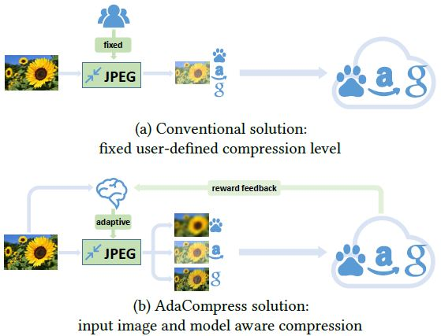
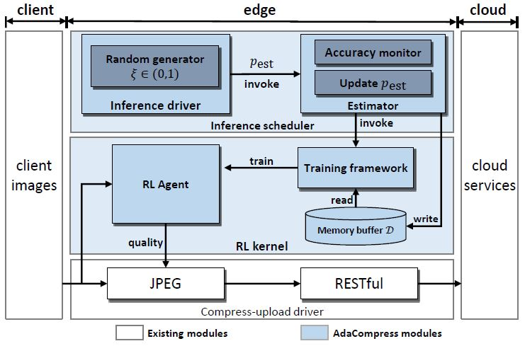
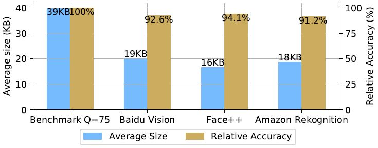

# AdaCompress: Adaptive compression for online computer vision services. (ACM MM 2019)

[](http://hits.dwyl.io/hosea1008/AdaCompress)

### Hongshan Li, Yu Guo, Zhi Wang, Shutao Xia, Wenwu Zhu

~~Paper Link: [arXiv]() or [ACM MM 2019]()~~ To be updated.

## Contents

1. [Abstract](#Abstract)
2. [Design](#Design)
3. [Code](#Code)
4. [Citation](#Citation)
5. [Poster or slides](#Poster)


<h2 id="Abstract">Abstract</h2>

With the growth of computer vision based applications and services, an explosive amount of images have been uploaded to cloud servers which host such computer vision algorithms, usually in the form of deep learning models. JPEG has been used as the *de facto* compression and encapsulation method before one uploads the images, due to its wide adaptation. However, standard JPEG configuration does not always perform well for compressing images that are to be processed by a deep learning model, e.g., the standard quality level of JPEG leads to 150% of size overhead (compared with the best quality level selection) on ImageNet under the same inference accuracy in popular computer vision models including InceptionNet, ResNet, etc. Knowing this, designing a better JPEG configuration for online computer vision services is still extremely challenging: 1) Cloud-based computer vision models are usually a black box to end users; thus it is difficult to design JPEG configuration by studying their model structures. 2) JPEG configuration has to change when different users use it. In this paper, we propose a reinforcement learning based JPEG configuration framework. In particular, we design an agent that adaptively chooses the compression level according to the input image's feature and backend deep learning models. Then we train the agent in a reinforcement learning way to adapt it for different deep learning cloud services that act as the *interactive training environment* and feeding a reward with comprehensive consideration of accuracy and data size. In our real-world evaluation on Amazon Rekognition, Face++ and Baidu Vision, our approach can reduce the size of images by 1/2–1/3 while the overall classification accuracy only decreases slightly.

<h2 id="Design">Design</h2>

### Reinforcement learning framework

A brief framework of AdaCompress is shown in Figure 1. Briefly, it is a DRL(deep reinforcement learning) based system to train an agent to choose the proper quality level for one image to be compressed by JPEG.

<p align="center">
  
  <br><i>Figure 1. Illustration of our adaptive compression solution.</i>
</p>

Basically, a specific cloud deep model acts as the training environment to train the AdaCompress agent. The AdaCompress agent chooses a proper compression quality for JPEG based on the input image's feature in the inference phase. More implement details can be found in our paper.

### Inference-estimate-retrain mechanism

As a running system,we introduce a running-estimate-retrain mechanism to cope with the scenery change in the inference phase, building a system with different components to inference, capture scenery change and retrain the RL agent. The overall system diagram is illustrated in Figure 2.

<p align="center">
  
  <br><i>Figure 2. Components of AdaCompress architecture.</i>
</p>

As shown in the system diagram Figure 2, basically, we build up the memory buffer $D$ and RL(reinforcement learning) training kernel based on the compression and upload driver. When the RL kernel is called, it will load transitions from the memory buffer $D$ to train the compression level predictor $\phi$. When the system is deployed, the pre-trained RL agent guides the compression driver to compress the input image with an adaptive compression quality according to the input image, and uploads the compressed image to cloud.

After the AdaCompress is deployed, the input images scenery context may change.(e.g., day to night, sunny to rainy), when the scenery changes, the older RL agent’s compression selection strategy may not be suitable for the new scenery, causing the overall accuracy decrease. In order to cope with this scenery drift issue, we invoke an estimator with probability pest. We do this by generating a random value $\xi \in (0, 1)$ and compare it to pest. If $ \xi \leq p_{\rm est}$ the estimator is invoked, AdaCompress will upload the reference image along with the compressed image to fetch accuracy, and save the transition to the memory buffer. The estimator will also compare the recent n steps’ average accuracy and the earliest average accuracy in memory, once the recent average accuracy is much lower than the initial average accuracy, the estimator will invoke the RL training kernel to retrain the agent to adapt to the current scenery.

And once the estimator found that the trained reward is higher than a threshold, it will stop the training kernel, returning to normal inference state.

### Performance

Comparing to the conventional JPEG compression quality, AdaCompress can reduce the upload transmission traffic by up to 1/2 on various deep learning cloud services, while the overall classification accuracy only decreases slightly.

<p align="center">
  
  <br><i>Figure 3. Compression and accuracy performance.</i>
</p>

<h2 id="Code">Code</h2>

The source code has been tested on:

- Python 3.5
- Numpy 1.15.2
- Tensorflow 1.8.0

The required extra packages are listed in [requirements.txt](requirements.txt)

Structure of the codes:

- [agents.py](src/agents.py): Implement of reinforcement learning agents.
- [environment.py](src/environment.py): Implement of the training environment, the environment provides `reset`, `step` functions and returns next image and rewards.
- [cloud_apis.py](src/cloud_apis.py): Calling cloud computer vision services and give the recognition results in the [environment.py](src/environment.py), in this way the training environment is model-specific.
- [inference_estimate_retrain.py](src/inference_estimate_retrain.py): Implement of the inference-estimate-retrain mechanism in the inference phase. __This is the main module to test inference-estimate-retrain mechanism.__
- [initial_train.py](src/initial_train.py): Initial training an AdaCompress agent from a specific environment. Evaluation phase can also be tested here. __This is the main module to train and test the RL agent.__
- others: utilities, verification code.
- [pretrained](pretrained/): A pretrained DQN agent trained on ImageNet and Baidu Vision Service to select 10 compression degrees.

<h2 id="Citation">Citation</h2>

In case of further research related to this work, please cite the following publication:

```
@inproceedings{adacompress,
  title={AdaCompress: Adaptive compression for online computer vision services},
  author={Hongshan Li and Yu Guo and Zhi Wang and Shutao Xia and Wenwu Zhu},
  booktitle={2019 ACM Multimedia Conference on Multimedia Conference},
  year={2019},
  organization={ACM}
}
```

<h2 id="Poster">Poster or slides</h2>

To be updated...
